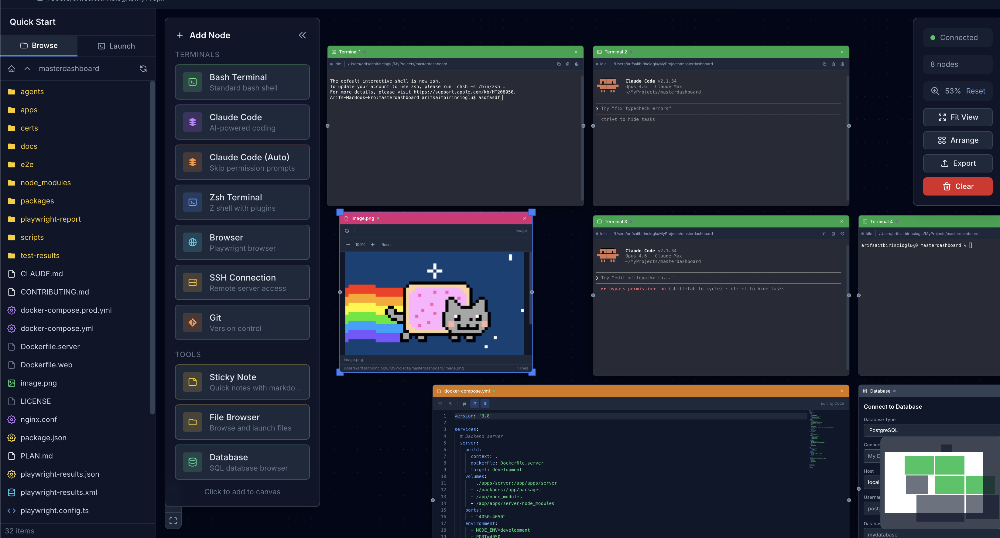

# Master Dashboard

[](https://www.npmjs.com/package/@asabialgo/create-masterdashboard)
[](https://opensource.org/licenses/MIT)
[](https://nodejs.org/)
[](https://pnpm.io/)

> **Platform:** macOS and Linux. Windows support is coming soon.

A persistent, web-based terminal orchestration platform. Think **tmux meets a visual canvas** -- manage multiple terminal sessions, SSH connections, databases, file browsers, and more, all from a single browser window.

## Why I Built This

I was running multiple Claude Code instances, SSH sessions, and terminal windows across different projects -- constantly losing track of which terminal was doing what, missing prompts waiting for input, and losing session state whenever my browser disconnected. I wanted a better working environment where I could visually organize all my terminal sessions on a canvas, see at a glance which ones need attention, and never lose a session again. Master Dashboard was born from that need.

Sessions run on the server (like tmux) and survive browser disconnects, network blips, and reconnections. The browser is just a viewer that can reconnect and replay buffered output.



## Features

### Terminal Management
- **Persistent sessions** -- terminals survive browser disconnect/reconnect with 20,000 lines scrollback
- **Multiple shell support** -- Bash, Zsh, Fish, PowerShell
- **Real-time status detection** -- visual indicators show working (green), waiting for input (yellow), or error (red)
- **Claude Code awareness** -- detects when AI tools are waiting for your response

### Visual Canvas
- **Drag-and-drop node layout** -- organize terminals, files, and tools on a React Flow canvas
- **Project workspaces** -- group sessions by project, each with its own canvas
- **Command palette** -- keyboard-driven workflow with shortcuts

### Node Types
| Node | Description |
|------|-------------|
| **Terminal** | Full PTY terminal with xterm.js |
| **SSH** | Remote SSH sessions |
| **Browser** | Playwright-based browser automation with live screencast |
| **Folder** | File browser with tree/list views |
| **Viewer** | Code viewer with Monaco Editor and markdown rendering |
| **Diff** | Side-by-side or unified file diff viewer |
| **Database** | SQL query editor with schema explorer (PostgreSQL, MySQL, SQLite) |
| **Git** | Visual Git operations -- staging, commits, branches, push/pull |
| **Notes** | Markdown sticky notes with color coding |

### Other Highlights
- **Session persistence** -- output buffered during disconnect, replayed on reconnect
- **50+ concurrent terminals** with <50ms input latency
- **Docker support** for both development and production
- **Tmux integration** for underlying session management

## Architecture

```
masterdashboard/
├── apps/
│   ├── web/           # Next.js 14 frontend (React Flow canvas)
│   └── server/        # Fastify backend (PTY, SSH, WebSocket)
└── packages/
    └── shared/        # Shared TypeScript types and constants
```

**Frontend:** Next.js 14 + React Flow + xterm.js + Zustand + Tailwind CSS

**Backend:** Fastify + node-pty + ssh2 + Playwright + better-sqlite3 + Socket.IO

**Monorepo:** Turborepo + pnpm workspaces

## Quick Start

```bash
npx @asabialgo/create-masterdashboard my-dashboard
cd my-dashboard
pnpm dev
```

## Getting Started

### Prerequisites

- **Node.js** 20+
- **pnpm** 8+
- **macOS or Linux** (Windows support coming soon)

### Option 1: Use the CLI (recommended)

```bash
npx @asabialgo/create-masterdashboard my-dashboard
cd my-dashboard
cp .env.example .env
cp apps/web/.env.example apps/web/.env.local
pnpm dev
```

### Option 2: Clone the repository

```bash
git clone https://github.com/AsabiAlgo/masterdashboard.git
cd masterdashboard

# Install dependencies
pnpm install

# Copy environment files
cp .env.example .env
cp apps/web/.env.example apps/web/.env.local

# Start development (frontend + backend)
pnpm dev
```

The frontend runs on `http://localhost:3050` and the backend on `http://localhost:4000`.

### Docker

```bash
# Development with hot reload
pnpm docker:dev

# Production
pnpm docker:build
pnpm docker:up
```

## Development

```bash
pnpm dev          # Start all services
pnpm build        # Build all packages
pnpm test         # Run unit tests
pnpm test:e2e     # Run Playwright E2E tests
pnpm typecheck    # TypeScript type checking
pnpm lint         # ESLint
```

### Individual Services

```bash
cd apps/web && pnpm dev        # Frontend only (port 3050)
cd apps/server && pnpm dev     # Backend only (port 4000)
cd packages/shared && pnpm build  # Build shared types
```


## Security Notice

Master Dashboard is designed for **local development use**. The server binds to `0.0.0.0` by default and does not include authentication. Do not expose it to untrusted networks without adding your own authentication layer.
We will work on improving this.

## Contributing

Contributions are welcome! See [CONTRIBUTING.md](CONTRIBUTING.md) for guidelines.

## License

[MIT](LICENSE) -- Arif Sait Birincioglu
